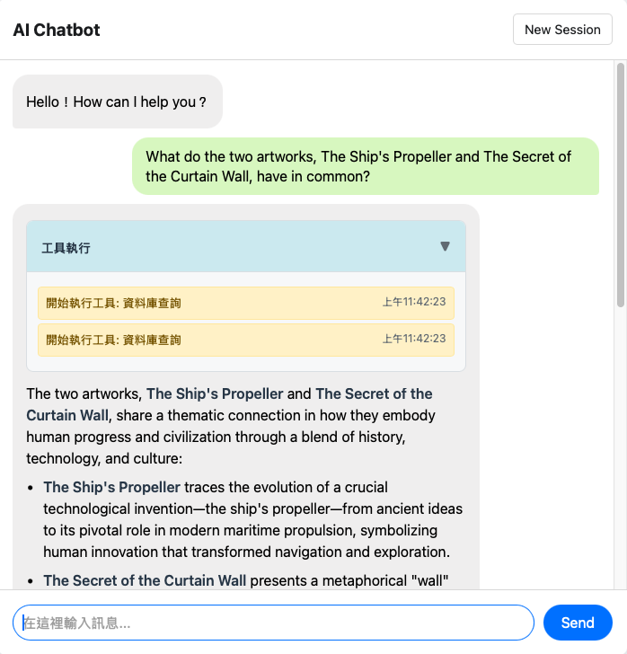

# Chatbot - RAG + Web Search AI Assistant

An AI assistant that combines RAG (Retrieval-Augmented Generation) with web search functionality, providing local knowledge base queries and real-time information search.

## ✨ Features

- 🤖 **Smart Conversation**: Natural language conversations using OpenAI GPT-4o model
- 📚 **RAG Knowledge Base**: Local Markdown document vectorized search
- 🌐 **Web Search**: Real-time access to latest information
- 💬 **Conversation Memory**: Multi-turn conversation context support
- 📱 **Lightweight Frontend**: Pure HTML/CSS/JS implementation, no additional frameworks needed
- 🔄 **Streaming Response**: Real-time AI response display
- 🎤 **Voice Input**: Speech-to-text functionality (requires HTTPS)

## 🖥️ User Interface



The application features a clean, intuitive chat interface with:

- **Chat Area**: Displays conversation history with distinct styling for user questions (green) and AI responses (white)
- **Tool Execution Panel**: Shows detailed execution steps when AI tools are used (RAG search, web search)
- **Input Field**: Simple text input for user queries with send button
- **New Session**: Button to start fresh conversations
- **Responsive Design**: Works seamlessly across different screen sizes

## 🛠️ Technical Architecture

### Backend
- **FastAPI**: High-performance web framework
- **LangChain**: RAG system implementation
- **FAISS**: Vector similarity search
- **OpenAI API**: GPT-4o model and text embeddings
- **DuckDuckGo Search**: Web search functionality

### Frontend
- **Native HTML/CSS/JS**: Lightweight implementation
- **Fetch API**: Handles streaming responses
- **Responsive Design**: Adapts to various devices

## 🚀 Installation & Setup

### 1. Requirements

- Python 3.8+
- Node.js (optional, for local development server)

### 2. Install Dependencies

```bash
# Install Python dependencies
pip install fastapi uvicorn openai python-dotenv
pip install langchain langchain-openai langchain-community
pip install faiss-cpu duckduckgo-search

# Or use requirements.txt (if available)
pip install -r requirements.txt
```

### 3. Environment Variables Setup

Create a `.env` file in the project root directory:

```env
# Required settings
OPENAI_API_KEY=your_openai_api_key_here

# Optional settings (with defaults)
OPENAI_MODEL=gpt-4o
KNOWLEDGE_BASE_PATH=docs/Museum_Collection_Info.md
```

### 4. Knowledge Base Preparation

Ensure the `docs/Museum_Collection_Info.md` file exists, or:

- Modify the `KNOWLEDGE_BASE_PATH` environment variable to point to your Markdown file
- File format should use standard Markdown heading structure (#, ##, ###)

## 🎯 Running the Application

### Method 1: Using Uvicorn (Recommended)

```bash
# Run from project root directory
uvicorn main:app --reload --host 0.0.0.0 --port 8000
```

### Method 2: Direct Python Execution

```bash
# If you've modified main.py to include __main__ block
python main.py
```

### 3. Open Frontend

Several ways to open the frontend:

**Option A: Direct File Opening**
```bash
# Open in browser directly
open index.html
# Or double-click the index.html file
```

**Option B: Using Simple HTTP Server**
```bash
# Python built-in server
python -m http.server 3000

# Or using Node.js
npx serve . -p 3000
```

Then open in browser:
- Backend API: http://localhost:8000
- Frontend Interface: http://localhost:3000 or directly open index.html

### 4. Quick Start (Recommended)

Use the provided startup script for the best experience:

```bash
python start_server.py
```

This script will:
- Automatically generate SSL certificates for HTTPS (required for voice features)
- Start both backend and frontend servers
- Open the application in your browser

Access the application at:
- **HTTPS (recommended)**: https://localhost:3000 or https://127.0.0.1:3000
- **HTTP (fallback)**: http://localhost:3001

⚠️ **Note**: Voice input functionality requires HTTPS. The script automatically generates self-signed certificates.

## 📋 Usage Instructions

### Basic Conversation
1. Enter your question in the input box
2. Click "Send" or press Enter
3. AI will automatically choose to use RAG search or web search based on the question

### Features

**RAG Search**:
- Automatically triggered when asking questions related to local knowledge base
- Example: "What is curtain wall?"

**Web Search**:
- Automatically triggered when real-time information is needed
- Example: "What's the weather like in Taipei today?"

**New Conversation**:
- Click the "Start New Conversation" button to clear chat history

## 🔧 Configuration

### Environment Variables

| Variable Name | Required | Default Value | Description |
|---------------|----------|---------------|-------------|
| `OPENAI_API_KEY` | Required | - | OpenAI API key |
| `OPENAI_MODEL` | Optional | `gpt-4o` | OpenAI model to use |
| `KNOWLEDGE_BASE_PATH` | Optional | `docs/Museum_Collection_Info.md` | Knowledge base file path |

### Model Selection

Supported OpenAI models:
- `gpt-4o` (recommended)
- `gpt-4o-mini`
- `gpt-4-turbo`
- `gpt-4`

### CORS Settings

Currently allowed origins:
- `http://localhost`
- `http://127.0.0.1`
- `null` (local file protocol)

## 🐛 Common Issues

### 1. OpenAI API Errors
**Problem**: Receiving 401, 403, or 429 errors
**Solutions**:
- Check if `OPENAI_API_KEY` is correctly set
- Confirm API key is valid and has sufficient credits
- Check API usage limits

### 2. Knowledge Base Initialization Failure
**Problem**: RAG search returns "Knowledge base not initialized"
**Solutions**:
- Confirm knowledge base file exists and path is correct
- Check if file encoding is UTF-8
- Ensure file content uses standard Markdown format

### 3. Web Search Failure
**Problem**: Web search returns errors
**Solutions**:
- Check internet connection
- Verify firewall settings
- May need to use proxy server

### 4. CORS Errors
**Problem**: Frontend cannot connect to backend API
**Solutions**:
- Confirm frontend and backend URL settings
- Modify CORS allowed origins in `main.py`
- Use the same protocol (http or https)

## 📁 Project Structure

```
RRRC_chatbot/
├── main.py                 # FastAPI application main program
├── rag_setup.py           # RAG system setup
├── tools.py               # Tool functions (RAG, web search)
├── index.html             # Frontend interface
├── docs/
│   └── Museum_Collection_Info.md  # Knowledge base file
├── rag_timestamp.json     # RAG timestamp (auto-generated)
├── .env                   # Environment variables (create manually)
└── README.md             # Documentation
```

## 🔒 Security Considerations

1. **API Key Protection**: Never commit `.env` file to version control
2. **CORS Settings**: Restrict allowed origins in production environment
3. **Input Validation**: Ensure user inputs are properly validated
4. **Rate Limiting**: Consider implementing API call frequency limits

## 📈 Performance Optimization Suggestions

1. **Caching Mechanism**: Implement RAG result caching
2. **Connection Pooling**: Use database connection pooling
3. **Asynchronous Processing**: Fully utilize FastAPI's asynchronous features
4. **CDN**: Use CDN for static resource acceleration

## 🤝 Contributing

Issues and Pull Requests are welcome!

## Notes

If using Mac and want to use ip address not localhost, please turn off the firewall.sudo /usr/libexec/ApplicationFirewall/socketfilterfw --setglobalstate off

1. 新開瀏覽器分頁 → 訪問 https://192.168.0.46:8000
2. 接受憑證警告 → 點擊"進階"→"繼續前往"
3. 確認連接 → 看到 {"detail":"Not Found"} 就成功了
4. 回到前端 → 重新載入 https://192.168.0.46:3000
5. 測試功能 → 輸入問題測試

